# ThumbyOne

## The One Firmware

> *One firmware to rule them all, one lobby to find them.*
> *One file to bring them all, and in the Thumby bind them.*

ThumbyOne is a unified multi-boot firmware for the [TinyCircuits Thumby Color](https://thumby.us/) — the pocketable colour handheld with a 128×128 screen and a pair of buttons that somehow play Doom. One flash gives you **NES**, **Master System**, **Game Gear**, **Game Boy**, **PICO-8**, **DOOM**, and the full **MicroPython + Tiny Game Engine** experience, each running with the whole device to itself.

<p align="center">
  
  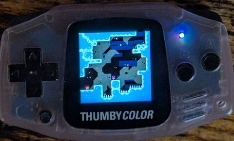
  
</p>

No per-system re-flashing. No "which firmware is this device running?" No re-formatting to share files. Pick a system from the lobby, it boots; every slot has a clear way back.

---

## Contents

- [What you get](#what-you-get)
- [Quickstart](#quickstart)
- [The lobby](#the-lobby)
- [Transferring files](#transferring-files)
- [Wiping / recovery](#wiping--recovery)
- [The systems](#the-systems)
  - [ThumbyNES](#thumbynes--nes--master-system--game-gear--game-boy)
  - [ThumbyP8](#thumbyp8--pico-8)
  - [ThumbyDOOM](#thumbydoom--shareware-doom)
  - [MicroPython + Tiny Game Engine](#micropython--tiny-game-engine)
- [Tips and troubleshooting](#tips-and-troubleshooting)
- [Technical specifications](#technical-specifications)

---

## What's new in 1.03

- **MicroPython games exit cleanly back to the picker.** If a game calls `sys.exit()`, `engine.end()`, raises an uncaught exception, or simply returns from `main.py`, the slot now reboots straight back into the MicroPython game picker instead of hanging on a dead REPL. Previously the device appeared frozen until you power-cycled it.

## What's new in 1.02

System-wide controls, consistent across every menu:

- **Global volume and brightness.** The lobby MENU overlay gets two new sliders — `VOLUME` and `BRIGHTNESS`. Set them once, they apply to every slot on launch: NES, SMS, GG, Game Boy, PICO-8, DOOM and every MicroPython game pick up the same values. Change volume inside any slot's menu and the lobby shows the new value next time you back out.
- **Brightness sliders in every slot menu.** ThumbyNES picker + in-game pause, ThumbyP8 picker + in-game pause, and the MicroPython picker all have a live brightness slider now — the backlight PWM tracks while you slide.
- **DOOM honours the system volume and brightness** too. On launch DOOM picks up whatever the lobby was set to; its own pause menu still works as a session-level override.
- **Consistent widgets**: thick right-aligned outlined slider across the lobby + every slot menu, press-and-hold autorepeat with identical timing everywhere (300 ms warm-up, 60 ms cadence), and every slider takes ~20 clicks end-to-end regardless of its internal range. Full-row highlighted cursor band in the lobby (used to be a hairline).
- **"Back to lobby" and "Quit to picker" are always the LAST menu item.** Press UP once from the top of any menu to wrap straight to back-out — the muscle-memory shortcut.

Cleanups:

- **No more "checking files" / "DEFRAGMENTING" flashes** on every NES launch. The auto-defrag was unreliable and fired unnecessarily; it's gone.
- **Lobby MENU tidied**. The old "Reboot lobby" action is gone (it was occasionally landing in a random slot) — close the menu via B / MENU / A-on-Close.
- **NES picker menu tidied**. Dead "Defragment now" action removed.
- **Minimum brightness lowered** (FLOOR 25 → 5, about 2 % duty). Room to dim the screen further for dark-room play without letting a slider set 0 = invisible.
- **Consistent disk display**. Every menu with a disk row reads "`X.XM / Y.YM`" used / total with the bar filling with used; previously the direction and formatting varied slot-to-slot.
- **Consistent battery readout**. One shared sampler (16-sample trimmed mean + EMA + ±2 % percent hysteresis) — the number stays put, stops flickering, and reads the same on every screen that shows it.

Under-the-hood fixes that you might notice:

- **DOOM no longer slows down** after saving a game or opening the LB+RB overlay menu — a flash-write bug that left the chip in slow-XIP mode has been fixed.
- **NES + P8 brightness actually applies.** Those slots share a PWM slice with their audio output, so the old hardware-PWM backlight was overwritten on every audio sample. The shared backlight driver now uses PIO PWM on a dedicated state machine; audio can't touch it.
- **MicroPython: no bright-frame flash** between menu redraws in the picker.

Storage format: system settings (volume + brightness) live in a single 4 KB flash sector — readable by every slot including DOOM, written only when you move a slider and close the menu.

See the [MENU overlay](#the-lobby) and per-slot menus for the slider rows; the [technical notes](#per-slot-architecture) explain the flash layout for curious readers.

---

## What you get

| System | What it plays | Content goes in |
|---|---|---|
| **ThumbyNES** | `.nes` (NES), `.sms` (Master System), `.gg` (Game Gear), `.gb` (Game Boy) | `/roms/` |
| **ThumbyP8** | `.p8.png` PICO-8 carts | `/carts/` |
| **ThumbyDOOM** | Shareware DOOM I — WAD baked into the firmware | *(none — embedded)* |
| **MicroPython + Engine** | Python games written against the [Tiny Game Engine](https://github.com/austinio7116/TinyCircuits-Tiny-Game-Engine) | `/games/<name>/` |

All four systems share one 9.6 MB FAT drive, visible over USB when you're in the lobby.

**Everything is optional.** If you never want DOOM, rebuild without it and reclaim 2.5 MB. If you only want the Python side, turn off the three emulators. See the [build matrix](#build-matrix).

---

## Quickstart

> ### ⚠️ Before you flash — please read
>
> Flashing ThumbyOne **replaces the stock TinyCircuits firmware** with a completely different system. This is a full takeover, not an overlay:
>
> - **The TinyCircuits launcher, stock games, and system files will be gone.** The 9.6 MB shared FAT is formatted on first boot of ThumbyOne — anything you had on the device (saves, scores, installed games) is wiped.
> - The device is easy to flash back to stock afterwards — just drop the official TinyCircuits `.uf2` onto the bootloader drive the same way. But stock firmware **doesn't expose a USB drive** — to back up anything from stock first (e.g. save files under `/Saves/`), connect via [Thonny](https://color.thumby.us/pages/getting-started-with-thonny/getting-started-with-thonny/) or `mpremote` and pull files over the REPL. Do that **before** flashing ThumbyOne.
> - ThumbyOne uses its own filesystem layout (`/roms/`, `/carts/`, `/games/`) — stock `/Games/` Python games won't be visible until you move them into `/games/`.
> - There is **no going back to stock with your data intact** once ThumbyOne has first-booted.
>
> If that all sounds fine, carry on.

---

### 1. Flash the firmware

**Download** `firmware_thumbyone.uf2` from the root of this repo (or the latest [release](https://github.com/austinio7116/ThumbyOne/releases)) — or [build from source](#build-matrix).

1. Power off the Thumby Color.
2. Hold **DOWN** on the d-pad and plug in USB.
3. The device appears as an `RPI-RP2350` drive on your computer.
4. Drag `firmware_thumbyone.uf2` onto it.
5. The device reboots into ThumbyOne. On first boot you'll see a brief "formatting shared FAT..." splash while the new layout is prepared, then the lobby appears.

### 2. Upload ROMs / carts / games

With ThumbyOne running, plug the device in (while sitting in the **lobby**). It enumerates as a USB drive called **ThumbyOne Storage**. Copy files into the right folder:

| Content | Folder | File types |
|---|---|---|
| NES / SMS / GG / GB ROMs | `/roms/` | `.nes`, `.sms`, `.gg`, `.gb`, `.gbc` |
| PICO-8 carts | `/carts/` | `.p8.png` |
| MicroPython games | `/games/<Name>/` | Folder per game with `main.py`, `icon.bmp`, `arcade_description.txt`, assets |

**Example:**
```
/roms/
    Super Mario Bros.nes
    Sonic.gg
    Tetris.gb
/carts/
    celeste.p8.png
    delunky.p8.png
/games/
    DeepThumb/
        main.py
        icon.bmp
        arcade_description.txt
        assets/
```

When you're done copying, **eject the drive** (Windows: right-click → Eject; macOS: drag to Trash; Linux: `sync && umount`). The on-screen USB dot turns from blue back to dim-grey; the physical LED goes back to green. Now pick a system with the d-pad and press **A**.

To transfer more files later: from inside any running system, **hold MENU** → back to lobby → plug USB → repeat. See [Transferring files](#transferring-files) for more on the USB state machine and LED indicators.

### 3. Returning to stock

Same procedure as flashing — hold **DOWN** on boot, drop the official [TinyCircuits firmware UF2](https://color.thumby.us/pages/firmware-and-updating/firmware-and-updating/) onto the `RPI-RP2350` drive. The device is back to factory state with a fresh empty FAT; your ThumbyOne data is gone.

---

## The lobby

The lobby is the home screen. It's a 2×2 grid of system icons: NES, PICO-8, DOOM, and MicroPython. Move with the **d-pad**, press **A** to launch.

<p align="center">
  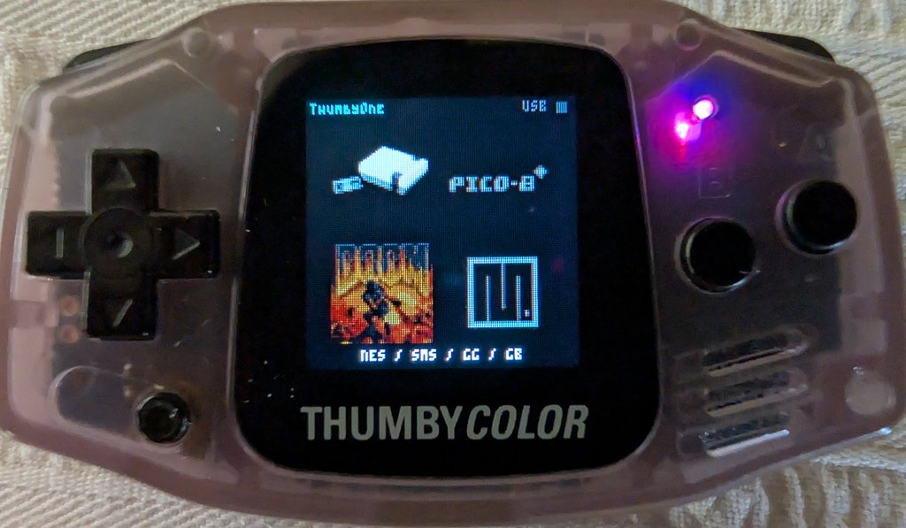
  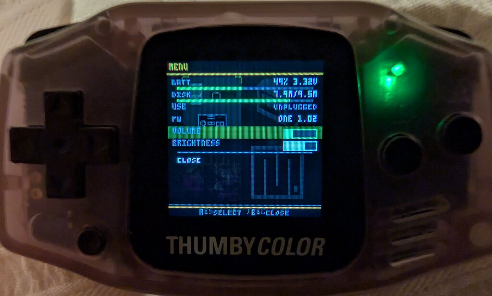
</p>

**Controls:**

| Button | Action |
|---|---|
| D-pad | Move selection between the four tiles |
| **A** | Launch the selected system |
| **MENU** | Open the lobby overlay (volume + brightness sliders, battery, disk, USB, firmware) |
| **MENU** (held at boot) | Force lobby (bypass any pending slot chain) |
| **LB + RB** (held at boot) | Wipe and reformat the shared FAT |

Inside the MENU overlay, **LEFT / RIGHT** adjusts the highlighted slider (brightness or volume). Changes apply live — the backlight dims as you scrub — and persist to the shared FAT so every slot picks them up on the next launch.

**Getting back to the lobby** depends on which slot you're in — each system has a native pause / picker menu with a **Back to lobby** item:

| Slot | Return gesture |
|---|---|
| ThumbyNES (NES / SMS / GG / GB) | **MENU** (hold ~0.5 s in-game) → pause menu → **Back to lobby** |
| ThumbyP8 (PICO-8) | **MENU** (hold ~0.5 s in-game) → PICO-8 pause menu → **Back to lobby** |
| ThumbyDOOM | In-game Main Menu → **Quit Game** (no confirm dialog in slot mode) |
| MicroPython + Engine | **MENU** held ~5 s in-game — direct reboot to the lobby (no on-screen prompt; game state is lost, so the hold is deliberately long to prevent accidents) |

A small **USB** label + LED dot in the top-right corner of the lobby — and the device's physical RGB LED — both show the USB state:

| On-screen dot | Physical LED | Meaning |
|---|---|---|
| green | green | USB cable not connected (idle) |
| blue  | blue  | Host has mounted the drive — safe to drop files |
| red   | red   | Transfer in flight — **do not unplug** |

The physical LED mirrors the on-screen dot so you can see at a glance whether a transfer is still happening even without looking at the screen. When a copy finishes the LED settles back to blue; when you eject or unplug, it goes back to green.

Slot-launch is held off while USB is active: if you're mid-copy and press A, ThumbyOne waits for the FAT to go quiet before handing off, so a half-written file never turns into a corrupt one on the slot.

---

## Transferring files

ThumbyOne exposes a **single** USB drive, and only while you're **in the lobby**. Sub-systems don't have their own USB drives — this is deliberate, and it's what "One firmware, one lobby" means:

- There is never a moment where both a host and a running slot are writing to the FAT.
- Windows / macOS / Linux see one device, with one drive letter, one identity.
- "Did I land in NES's drive or P8's drive?" is a question that no longer exists.

**Workflow:**

1. Boot into the lobby.
2. Plug in USB. A drive appears named **ThumbyOne Storage**.
3. Drop files into the right folder:
   - ROMs into `/roms/` (any of `.nes`, `.sms`, `.gg`, `.gb`)
   - PICO-8 carts into `/carts/` (`.p8.png`)
   - MicroPython games into `/games/<GameName>/` (a folder per game with `main.py` + assets)
4. Eject the drive (Windows: right-click → Eject; macOS: drag to Trash; Linux: `sync && umount`).
5. Pick a system with the d-pad, press A.

To transfer more later: pick MENU inside any system → **Back to lobby** → plug in → repeat.

---

## Wiping / recovery

Two escape hatches for when something goes wrong:

**Hold MENU at boot** → forces the lobby even if a pending slot-chain would otherwise try to start a broken slot. Useful after a bad flash or a hang.

**Hold LB + RB at boot** → the lobby prompts you to keep both held for a one-second countdown, then wipes and reformats the whole 9.6 MB shared FAT. Erases all ROMs, carts, games, and saves. Only needed if the FAT itself is corrupt (no slot can read it, or the PC says "unformatted disk").

No driver weirdness, no Windows Format dialog, no `mpremote` incantations. LB + RB at boot is the canonical wipe.

---

## The systems

### ThumbyNES — NES / Master System / Game Gear / Game Boy

*Based on [ThumbyNES](https://github.com/austinio7116/ThumbyNES) — see that repo for the standalone firmware, the full feature list, and detailed docs.*

<p align="center">
  
  
  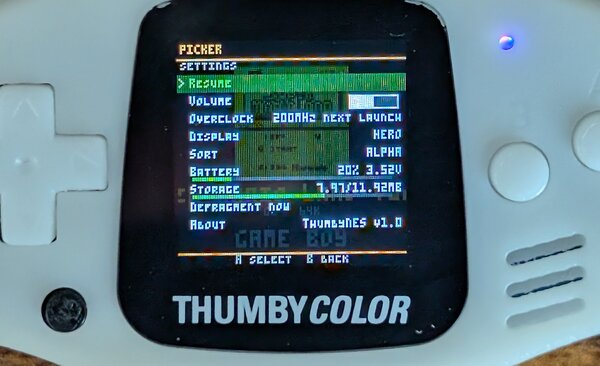
</p>

A four-in-one retro emulator running Nofrendo for NES, smsplus for Master System + Game Gear, and Peanut-GB (with minigb_apu) for Game Boy DMG. Drop `.nes`, `.sms`, `.gg`, or `.gb` into `/roms/`; the tabbed picker groups them by system, shows thumbnails and metadata, and lets you favourite.

<p align="center">
  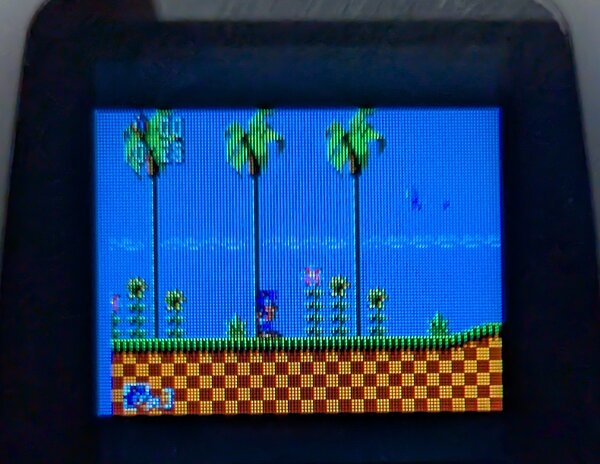
  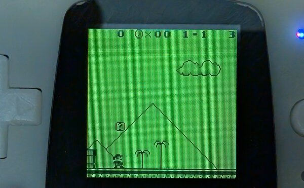
</p>

**Features:**

- Per-ROM save states, per-ROM settings, favorites
- In-game pause menu (MENU button)
- Fast-forward, palette switching, idle sleep
- Live-pan read mode for Game Boy / GG (the 128×128 screen is narrower than the native output; pan to see the edges)
- Automatic FAT defragmenter for large ROMs
- Configurable CPU clock per-ROM

**ThumbyOne differences:**

- ROMs live in **`/roms/`** on the shared FAT (stock ThumbyNES puts them at the root).
- USB transfers happen in the ThumbyOne lobby, not here — returning to the lobby is the "drop a new ROM" workflow.
- The standalone ThumbyNES logo splash and file-scan diagnostic are skipped — you go straight from the lobby's handoff into the picker.
- The in-game menu's **Back to lobby** item cleanly unmounts the FAT and hands off.

**Controls:**

| Button | Action |
|---|---|
| D-pad | Navigate picker / drive in-game |
| LB / RB | Switch tabs (picker) / shoulder buttons (in-game) |
| A / B | Launch / in-game A & B |
| MENU (tap) | Open picker menu |
| MENU (held ~0.5 s, in-game) | Open the in-game pause menu (contains **Back to lobby**, save-state, palette, fast-forward, etc.) |
| Hold B (on picker) | Toggle favourite for the highlighted ROM |

### ThumbyP8 — PICO-8

*Based on [ThumbyP8](https://github.com/austinio7116/P8Thumb) — a clean-room PICO-8 runtime. PICO-8 is a trademark of [Lexaloffle](https://www.lexaloffle.com/pico-8.php); if you enjoy playing carts, **please buy PICO-8** to support the creators and the community.*

<p align="center">
  
  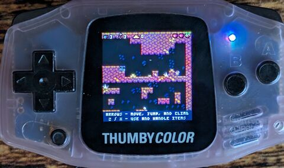
  
</p>

A full PICO-8 fantasy console with 4-channel audio, the native 128×128 display, and cart conversion that runs on-device. Drop `.p8.png` cart files into `/carts/`; the next boot converts them into playable bytecode (one cart per reboot cycle, a few seconds each), and you're off.

<p align="center">
  
</p>

**Features:**

- Favorites + most-played sort modes
- In-game pause menu with brightness, volume, save-state
- Multi-cart chain (PICO-8's `load()` call works across reboots)
- On-device `.p8.png` → bytecode conversion — no host tools

**ThumbyOne differences:**

- Carts live in **`/carts/`** on the shared FAT (same as standalone P8).
- The standalone "welcome, drop carts" lobby screen is skipped — direct to picker.
- Menu has a **Back to lobby** entry.

**Controls:**

| Button | Action |
|---|---|
| D-pad | D-pad |
| A | X / confirm |
| B | O / cancel |
| MENU (tap, in picker) | Open the picker menu (sort, favourites, back to lobby) |
| MENU (held ~0.5 s, in-game) | Open PICO-8 pause menu (save state, back to lobby, cart `menuitem()` entries) |

### ThumbyDOOM — shareware DOOM

*Based on [ThumbyDOOM](https://github.com/austinio7116/ThumbyDOOM) — based on Graham Sanderson's rp2040-doom.*

<p align="center">
  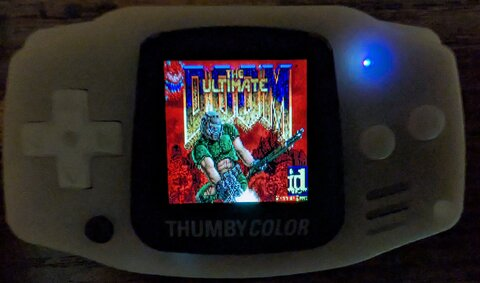
  
  
</p>

The real deal. Music, sound effects, save games, screen melts, all on a 128×128 LCD. The shareware WAD is baked into the firmware; no files to transfer.

**Features:**

- Full shareware DOOM I (E1M1 – E1M9)
- 12-bit PWM DAC audio with dithering — OPL2 music (via [emu8950](https://github.com/digital-sound-antiques/emu8950)) + 8-channel ADPCM SFX mixed on core1
- Save / load to flash (6 save slots)
- Overlay menu (hold **LB + RB** for 3 s) with brightness, gamma, volume, controls scheme, and cheats (god / all-weapons / no-clip / level warp)
- Persistent settings (slot 7) survive power cycles

**ThumbyOne differences:**

- WAD is in the firmware itself (2.5 MB), so DOOM never touches the shared FAT — it plays just fine even on a freshly-wiped device.
- The in-game **Quit Game** menu item returns to the lobby directly — the vanilla "Are you sure? (Y/N)" confirm dialog is short-circuited under `THUMBYONE_SLOT_MODE`.
- Hold-MENU as a cross-slot chord isn't wired up in DOOM yet; use Main Menu → Quit Game.

**Controls:**

| Button | Action |
|---|---|
| D-pad | Move / menu navigate |
| A | Fire / confirm |
| B | Use / cancel (hold for automap) |
| B + LB / B + RB | Prev / next weapon |
| MENU | Main Menu (Save / Load / Options / Quit Game) |
| LB + RB (hold 3 s) | Overlay menu (cheats, gamma, volume, warp) |

### MicroPython + Tiny Game Engine

*The stock Thumby Color experience — [TinyCircuits-Tiny-Game-Engine](https://github.com/austinio7116/TinyCircuits-Tiny-Game-Engine) plus MicroPython.*

<p align="center">
  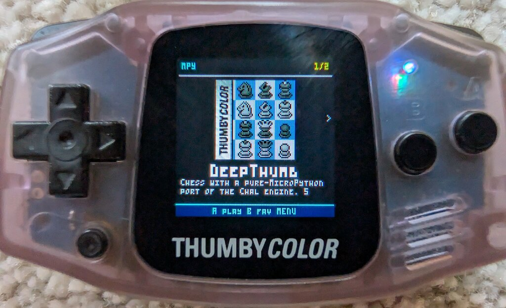
  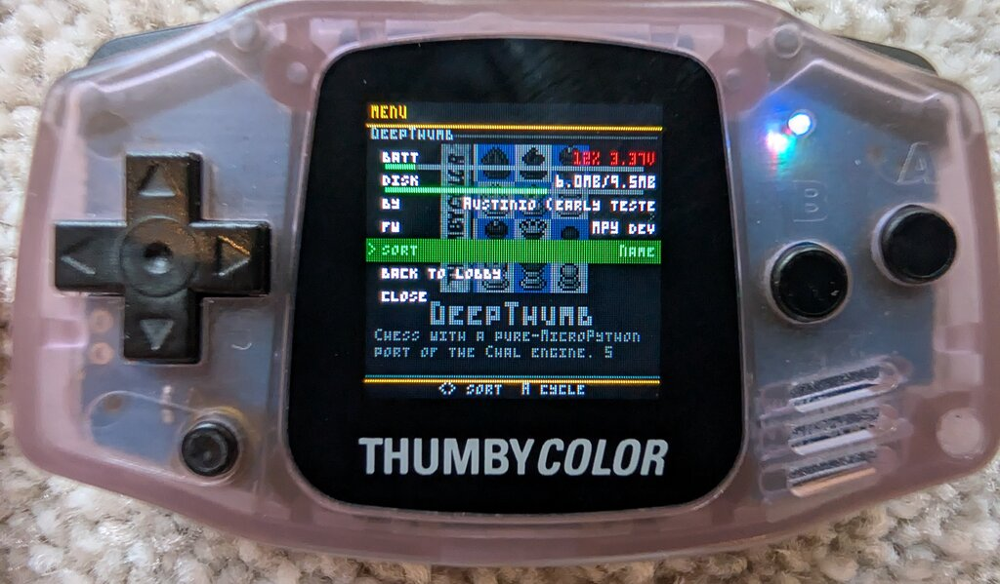
  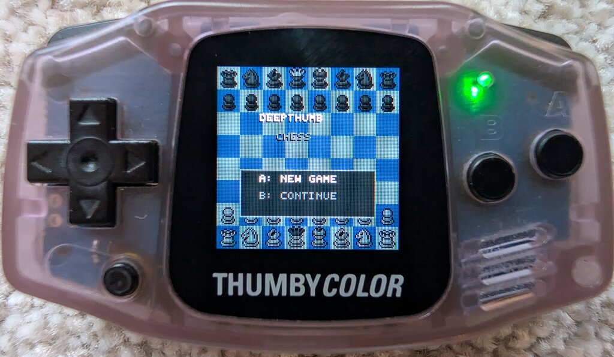
</p>

MicroPython with the Tiny Game Engine C module baked in, running a custom C picker that replaces the stock launcher entirely. Drop a game folder into `/games/<GameName>/` with a `main.py`, an `icon.bmp`, and an `arcade_description.txt`, and it appears on the hero picker with full artwork, title, and blurb.

**Features:**

- One-game-per-screen hero picker with 64×64 icons + description blurb
- Favourites (press **B** on any game to star it — no menu needed)
- Three sort modes: Name, Favourites first, Author
- Menu overlay with live battery + free-disk + sort selector + back-to-lobby, matching the NES menu style
- Engine's `/system/` assets served from firmware ROM — no FAT space wasted on fonts and splash graphics

**ThumbyOne differences vs. the stock Thumby Color launcher:**

- **Custom C picker** replaces the launcher: loads instantly (no Python startup wait), shows a proper hero view.
- **ROM-backed `/system/`** — the engine's `filesystem/system/` tree (fonts, splashes, launcher assets, ~376 KB) is packed into the firmware image and mounted as a read-only MicroPython VFS. Saves FAT space and means `/system/` is always available without a first-boot copy.
- **No USB REPL** — the MPY slot doesn't enumerate as a serial port because the lobby owns USB. Games just run; no Thonny connection possible while in a game. Lobby-based transfers only.
- **Flash scratch partition** — `TextureResource(in_ram=False)` stores into the upper 768 KB of the MPY partition rather than the chip-wide default, so loading textures doesn't clobber sibling slots.
- **Per-game saves** — each game gets its own `/Saves/games/<name>/` namespace.

**Controls:**

| Button | Action |
|---|---|
| D-pad | Step through games |
| A | Launch the selected game |
| B | Toggle favourite (★) for the highlighted game |
| MENU (in picker) | Open info overlay (battery, disk, sort, back to lobby) |
| MENU (held ~5 s in-game) | Reboot to the lobby (no splash; game state is lost) |

**Game structure** in `/games/<name>/`:

```
/games/DeepThumb/
    main.py                  # entry point
    icon.bmp                 # 16 bpp RGB565, up to 64x64
    arcade_description.txt   # line 1 = title; rest = description blurb; optional "Author: ..." line
    assets/
        sprites.bmp
        music.wav
```

The icon + description are optional (picker falls back to the directory name and a placeholder tile), but having them makes your game look at home next to everything else on the picker.

---

## Tips and troubleshooting

**The picker takes a few seconds to appear after I pick a system.**
That's the bootrom chaining into the slot partition — NES in particular has to re-initialise USB clocks and LCD DMA. P8 is snappy; DOOM is basically instant.

**I dropped a game into `/games/` but the picker doesn't see it.**
The picker scans at boot. Return to the lobby (MENU → Back to lobby), plug in, check the folder has a `main.py`, eject, re-enter MPY.

**The MPY game just shows a blank screen.**
The launcher writes any game crash to `/.last_error.txt` on the shared FAT. Return to the lobby, plug in USB, open that file from the drive for a Python traceback.

**My PC is still showing an old "ThumbyNES Carts" drive from a pre-ThumbyOne flash.**
ThumbyOne enumerates as a different USB product ID to avoid driver-letter collision, but your host's `Devices and Printers` may remember old entries. Harmless; delete from there if it's cluttering things up.

**Everything's broken after a bad transfer.**
Hold **LB + RB** at boot, hold them through the countdown — fresh FAT, pristine device.

---

---

# Technical specifications

*Below the line: internals, architecture, build system. Skip unless you're curious about how the pieces fit.*

## Architecture at a glance

```
                               ┌─────────────────────────────────────┐
                               │            16 MB flash              │
                               │                                     │
                              ┌┤  0x000000  ──── Lobby (128 KB)      │
                              ││             (selector, USB MSC)     │
               bootrom        ││  0x020000  ──── NES slot  (1 MB)    │
              rom_chain      ─┤│  0x120000  ──── P8  slot  (512 KB)  │
              image →         ││  0x1A0000  ──── DOOM slot (2.5 MB)  │
              chosen slot     ││  0x420000  ──── MPY slot  (2 MB)    │
                              ││  0x620000  ──── P8 active-cart (252 KB) │
                              ││  0x65F000  ──── Settings sector (4 KB)  │
                               │  0x660000  ──── Shared FAT (9.6 MB) │
                              ─┤                                     │
                               │  (NES/P8/DOOM/MPY all mount the     │
                               │   shared FAT via common FatFs.)     │
                               └─────────────────────────────────────┘
                                           ▲
                                           │  USB MSC (drive letter)
                                           │
                                      ┌─────────┐
                                      │   PC    │  only when in lobby
                                      └─────────┘
```

Each slot is a **completely independent** firmware image, laid out at flash offset `0x10000000` as it would be if it owned the chip. The bootrom's `rom_chain_image()` remaps physical flash at boot via QMI ATRANS so the chosen slot sees itself at the base of XIP and runs unmodified. When a slot wants to return to the lobby it writes a handoff magic into watchdog scratch and triggers a reset; the lobby's `main()` consumes the magic and chains to the target.

No two slots are in memory at the same time. Each slot has the whole 520 KB SRAM to itself.

## Flash layout

| Partition  | Offset     | Size    | XIP address     | Purpose |
|-----------:|-----------:|--------:|-----------------|---------|
| Lobby      | `0x000000` | 128 KB  | `0x10000000`    | Selector, USB MSC, mkfs, handoff consumption |
| Handoff sector | `0x010000` | 4 KB | `0x10010000`    | Cross-slot payload (bigger than watchdog scratch can hold) |
| NES        | `0x020000` | 1 MB    | `0x10020000`    | ThumbyNES firmware |
| P8         | `0x120000` | 512 KB  | `0x10120000`    | ThumbyP8 firmware |
| DOOM       | `0x1A0000` | 2.5 MB  | `0x101A0000`    | ThumbyDOOM + shareware WAD |
| MPY        | `0x420000` | 2 MB    | `0x10420000`    | MicroPython + engine + 768 KB resource scratch |
| P8 scratch | `0x620000` | 252 KB  | `0x10620000`    | P8 active-cart working area (survives reboots into other slots) |
| Settings sector | `0x65F000` | 4 KB | `0x1065F000`    | System-wide volume + brightness. 8-byte header (`TSM1` magic + two bytes), rest is `0xFF`. Written by the lobby + any slot menu that moves a slider; read by every slot (including DOOM) via XIP — no FatFs required. |
| Shared FAT | `0x660000` | 9.6 MB  | `0x10660000`    | `/roms`, `/carts`, `/games`, `/Saves`, `/.favs`, `/.active_game` |

Canonical source: [`common/slot_layout.h`](common/slot_layout.h). Keep it in lock-step with [`common/pt.json`](common/pt.json), which is the partition table consumed by the RP2350 bootrom.

## Boot and handoff

**Lobby startup** (`lobby/lobby_main.c`):

1. Init MENU button first — holding it at boot escapes to lobby even if a stale handoff magic would otherwise chain into a broken slot.
2. If no override held, consume any pending handoff via `thumbyone_handoff_consume_if_present()` — if there's one, the bootrom chains into the target and never returns.
3. Otherwise init LCD, buttons, USB, mount the shared FAT, render the grid.

**Slot entry** (applies to NES, P8, DOOM, MPY):

- Each slot links at `0x10000000` as though it owned the chip. The bootrom's ATRANS remap makes this a lie.
- On entry, each slot runs `thumbyone_xip_fast_setup()` from RAM. This resets the flash chip (Winbond 66h / 99h reset-enable / reset pair) and reconfigures QMI for fast continuous-read XIP. Without this step, flash left in continuous-read mode from the lobby's boot_stage2 is mis-interpreted when the slot first reconfigures QMI — we tracked an NES blank-screen hang to exactly this for a full day. See [`common/thumbyone_handoff.c`](common/thumbyone_handoff.c) and the memory note at [feedback_rp2350_xip_reset_first.md](https://github.com/austinio7116/ThumbyOne).

**Return to lobby:**

- Slot writes a "return to lobby" sentinel into watchdog scratch registers, calls `watchdog_reboot()`.
- Bootrom restarts, lobby consumes the sentinel, `rom_chain_image()` loads lobby firmware into place (no-op — it's already at `0x10000000`), lobby runs normally.

## Shared filesystem

The 9.6 MB FAT at `0x10660000` is a plain FAT16 volume with 1 KB clusters, label `THUMBYONE`. All five participants (lobby + four slots) use the **same** FatFs R0.15 code, compiled from [`common/lib/fatfs/`](common/lib/fatfs/) with the same `ffconf.h`, linked against the same block device [`common/fs/thumbyone_disk.c`](common/fs/thumbyone_disk.c).

**Only the lobby ever calls `f_mkfs()`.** Slots strictly mount-or-fail. This guarantees on-disk layout identity across slots — a FAT written by the NES slot is byte-compatible with a FAT read by the MPY slot.

`thumbyone_disk.c` is a 512-byte-sector block device over 4 KB flash erase blocks, with read-modify-erase-program for sub-erase writes. Writes disable interrupts for the ~50 ms erase+program window per sector; this is why the lobby holds off slot launches for 500 ms after the last USB MSC op.

**MicroPython compatibility:** the MPY slot uses stock upstream FatFs R0.15 rather than the ooFatFs fork MicroPython historically carried. Port details in [`extmod/vfs_fat_diskio.c`](https://github.com/austinio7116/micropython/blob/thumbyone-slot/extmod/vfs_fat_diskio.c) — we rewrote the diskio shim for plain FatFs API and added a pre-mount fallback through `thumbyone_disk` for the pre-Python picker window.

## USB MSC centralisation

Single entry point for host transfers: `lobby/lobby_usb.c`.

- **Composite-less device** — MSC only, no CDC. Descriptor set is minimal (one interface, two endpoints).
- **Distinct VID/PID** (`0xCAFE:0x4020`) and serial prefix (`ONE-<board uid>`) so Windows doesn't inherit drive-letter assignments from earlier slot-era firmwares that used `0xCAFE:0x4011`.
- **tud_msc callbacks route directly to `thumbyone_disk_*`** — no deferred-write cache, because the RMW is already synchronous at the disk layer. Simpler state, no SYNCHRONIZE_CACHE work.
- **Slot-launch debounce** — lobby tracks `lobby_usb_last_op_us()`; A-press is accepted but handoff is held back until MSC has been quiet for 500 ms, so an in-flight `WRITE(10)` finishes before the FAT gets handed to a slot.

Slots carry no tinyUSB stack at all in ThumbyOne-slot-mode builds. We strip tinyUSB device + class drivers + descriptors, gate every `tud_task()` / `tusb_init()` / `tud_mounted()` call site behind `#ifndef THUMBYONE_SLOT_MODE`, and rely on `--gc-sections` to drop the rest. Per-slot savings: ~15 KB flash on NES/P8, ~27 KB on MPY, and several KB of SRAM each.

## Per-slot architecture

Every slot has a 520 KB SRAM budget and a ~250 MHz default clock (higher on overclock). Each has been individually tuned to maximise performance and compatibility while keeping RAM usage inside those limits. The lists below are the highlights — see the slot repos for the full story.

### NES / SMS / GG / GB slot

**Emulator cores** (all vendored under [`ThumbyNES/vendor/`](https://github.com/austinio7116/ThumbyNES/tree/main/vendor)):

- **Nofrendo** (GPLv2) — NES 6502 + PPU + APU.
- **smsplus** (GPLv2, from the retro-go fork) — Master System / Game Gear Z80 + VDP + PSG.
- **Peanut-GB** (MIT) — Game Boy DMG core.
- **minigb_apu** (MIT) — Game Boy 4-channel APU, paired with Peanut-GB.

**Performance & compatibility:**

- **Multi-core dispatcher** (`nes_device_main.c`) switches between Nofrendo / smsplus / Peanut-GB based on file extension; only one core is linked into the hot path per cart.
- **Per-cart clock override** — global + per-ROM selection of 125 / 150 / 200 / 250 MHz; dispatcher re-runs `nes_lcd_init` + `nes_audio_pwm_init` on every launch so SPI dividers and audio IRQ rate follow the new clock correctly.
- **Hot loops in SRAM** — `IRAM_ATTR` / `.time_critical.*` placement on the CPU+PPU inner loops so XIP cache misses never hit the frame budget. v1.01 also moved the smsplus Z80 core out of flash into RAM for a large SMS/GG speedup.
- **Zero-copy XIP ROM execution** — the picker walks FAT cluster chains for any ROM ≥256 KB, checks contiguity, and hands the core a direct pointer into the XIP address space. Fragmented ROMs trigger the in-firmware defragmenter (`f_expand` reserves a contiguous chain, then streams the file through a 4 KB buffer).
- **Per-system scalers** — NES 2:1 nearest or 2×2 box-blend to 128×120 letterbox; SMS FIT / BLEND / FILL (new 1.5× fill in v1.02); GG & GB asymmetric 5:4 × 9:8 nearest; a live-pan CROP mode where the cart keeps running while MENU + d-pad scrolls the 128-wide window over the native picture.
- **Region detection** — iNES 2.0 byte-12, iNES 1.0 byte-9, with a filename fallback (`(E)`, `(PAL)`, `(Europe)`) — overridable per-ROM.
- **Per-ROM save states** (NES / SMS: SNSS-tagged; GB: `'GBCS'`-tagged `gb_s` + APU memcpy) via a thin `thumby_state_bridge.[ch]` patch that macros `STATE_OPEN` / `STATE_WRITE` in nofrendo & smsplus over a single shared `FIL` for atomic save/load.
- **Palette cycling** — six selectable palettes for NES and GB; SMS / GG drive their VDP palettes natively.
- **Fast-forward 4× with audio preservation** — four cart frames per loop, only the newest rendered; audio ring untouched so FX don't stutter.
- **30 s battery-SRAM autosave** + 90 s idle → LCD blank + tight sleep.
- **Tabbed picker** with per-tab selection memory, favourites (hold B), 5–10 s B-hold to delete, live USB-activity rescan (polls MSC activity, rescans FAT after 400 ms of host quiet).

**SRAM discipline:**

- **One shared 32 KB RGB565 framebuffer** (`static uint16_t fb[128*128]`) across all three runners — no double-buffer.
- **Per-core source framebuffers** (NES ~137 KB, SMS ~98 KB, GB ~92 KB) are **malloc'd by each core's `init()` and freed by `shutdown()`** — only the active core's buffer occupies heap.
- **Cores coexist in BSS, not heap** — Nofrendo (~30 KB) + smsplus (~80 KB) + Peanut-GB (~30 KB) all present in the image, but only one is active at a time.
- Menu backdrop is a reused `static uint16_t fb_dim[128*128]` — allocated once, only in use while the menu is open.
- FAT scans use a single `static uint8_t fat_sec[512]`; defragger uses a single `static uint8_t buf[4096]` — no per-call mallocs.
- Screenshots stream one row at a time (no 8 KB scratch buffer).
- Typical free heap in-game: ~330 KB.

**Slot-mode adjustments** (`#ifdef THUMBYONE_SLOT_MODE`):

- ROMs + sidecars (saves, screenshots, state files, favourites) live under `/roms/` rather than the filesystem root.
- Boot splash + file-check diagnostic silent unless the defragger is actually running.
- MSC + tinyUSB excluded — ~15 KB flash + several KB RAM reclaimed.
- Picker's settings menu grows a "Back to lobby" action; in-game menu gains the same.
- `boot_filesystem()`'s auto-format on mount-failure is gated out — slots never wipe the shared FAT.

### PICO-8 slot

**Runtime**: clean-room PICO-8 fantasy console implementation. Uses **Lua 5.2.4** (`LUA_VERSION_NUM == 502` in [`ThumbyP8/lua/lua.h`](https://github.com/austinio7116/P8Thumb/blob/main/lua/lua.h)) — 5.2 and not 5.3 because 5.2's integer/bitwise story maps directly onto PICO-8's 16.16 fixed-point numeric model.

**Performance & compatibility:**

- **On-device cart conversion pipeline** (`.p8.png` → playable bytecode), running entirely on the Thumby:
  - stb_image streaming PNG decode via file-I/O callbacks (no full PNG in heap).
  - PXA decompressor for PICO-8's compressed code section.
  - **shrinko8 streaming tokenizer + parser + emitter** — a C port of shrinko8's unminify pass; handles minified PICO-8 source and converts PICO-8's fixed-point bitwise operators (`band`, `bor`, `shl`, `rotl`, `flr`, `\`, `@`, `$`, `%`, `!=`, `+=` etc.) to their Lua 5.2 equivalents during emission.
  - PICO-8 dialect character-level transforms: `\` → `p8idiv()`, `@` / `$` / `%` / `!=` → runtime calls, button glyphs → indices, `0b1010` binary → decimal, P8SCII high bytes → numeric escapes.
  - `luaL_loadbuffer` + `lua_dump` → Lua bytecode, programmed into the 256 KB active-cart scratch partition at `0x620000`.
  - One cart per boot cycle — prevents the ~260 KB PNG peak from fragmenting the Lua heap across multiple conversions.
- **int32 16.16 fixed-point numerics** — `lua_Number = int32_t` interpreted bit-for-bit as PICO-8's fixed-point format. Bitwise ops work on 32-bit patterns with no float round-trip, so `0xbe74` round-trips through `band` / `bor` / `shl` as an address without precision loss.
- **`_ENV` metatable fallback** — every source-level binding site gets `{__index = _G}` patched in so bare-global references in cart code still resolve under Lua 5.2's lexical env model.
- **String byte-indexing via metatable** — `str[i]` returns the byte value (PICO-8 convention) via a custom `__index` on the string metatable.
- **Multi-cart `load()` chain** — implemented as `watchdog_reboot` with `/.pending_load` marker + transition param plumbed through `stat(6)`; sub-carts hidden in `/.hidden` to declutter the picker.
- **`menuitem(index, label, cb)`** — up to 5 cart-defined custom pause-menu items, fully interoperating with our Back-to-lobby entry.
- **Full 4-channel audio synth** — 8 waveforms, pattern-advance with loop / stop flags, fade-in / fade-out, `fillp` patterns, `tline` tilemap blits, full P8SCII font rendering.

**SRAM discipline:**

- **XIP bytecode execution** — `lundump.c` patched so when the undump buffer address is in the XIP range (`0x10000000..0x11000000`, `IS_XIP_ADDR`), `Proto.code[]` and `Proto.lineinfo[]` become **direct flash pointers** instead of heap-copied arrays. `lfunc.c` patched so the GC never tries to free those XIP-resident arrays. Saves 40–80 KB of Lua heap per cart.
- **Debug info stripped** at `lua_dump` — reclaims another 5–20 KB per cart.
- **Capped allocator** — Lua VM hard-capped at 280 KB (`P8_LUA_HEAP_CAP`) so large carts OOM cleanly inside Lua rather than starving libc.
- **PICO-8 machine memory is `static uint8_t mem[64 KB]`** — drawing writes 4-bit colour indices straight into that (not RGB565). The present step expands indices → RGB565 **one scanline at a time** through a reused `static uint16_t scanline[128]`. Halves the RAM cost of the screen.
- **Cart ROM is `const uint8_t *` into XIP on device** (zero SRAM). Host build is the only path that malloc's it.
- **Streaming shrinko8 uses ~90 KB peak** — no AST, no token array, the C call stack *is* the parse tree.
- **Fixed-position Lua VM in BSS** — avoids heap fragmentation on successive cart loads.
- **Reboot-on-exit** — quit-to-picker triggers a watchdog reboot, guaranteeing the Lua heap is reclaimed cleanly with zero fragmentation carryover.
- **16 KB stack** (`PICO_STACK_SIZE=0x4000`) — default 2 KB is too small for PICO-8 C → Lua → C reentry.
- BSS ~148 KB, free heap in-game ~356 KB (280 KB Lua cap + ~76 KB libc headroom).

**Slot-mode adjustments**:

- Welcome / USB-mount-wait screen skipped — direct to picker.
- MSC + tinyUSB excluded.
- Picker menu grows a "Back to lobby" action.
- `boot_filesystem()` auto-format gated out.

### DOOM slot

Based on Graham Sanderson's [rp2040-doom](https://github.com/kilograham/rp2040-doom) port of Chocolate Doom, retargeted to RP2350 + Thumby Color. Shareware IWAD embedded via `.incbin` — ~2.3 MB, fits in the 2.5 MB partition with room. Pure XIP — the code runs direct from flash; no ROM load, no FAT access, no USB.

**Performance & compatibility** (`#if THUMBY_NATIVE` / `#if THUMBYONE_SLOT_MODE`):

- **Full 32-bit pointer model** — `shortptr_t` defanged to `void *` on RP2350; Doom's original 256 KB window / base-offset pointer compression is gone. Simpler, faster, fits the RP2350's memory map.
- **Single-core display pipeline** — the original rp2040-doom used PIO scanvideo + core1 beam-racing. On Thumby we render into a 128×128 8-bit indexed framebuffer on core0, palette-convert to RGB565 on the fly, and DMA to the GC9107. All the scanline / PIO machinery deleted.
- **Custom RGB565 melt wipe** in `i_video_thumby.c` — classic random-walk acceleration, operates directly on `g_fb`. The vanilla state machine is killed so the game tick keeps advancing during the wipe (audio / level state both continue).
- **320×200 overlay buffer** (`v_overlay_buf`) for HUD / menu / intermission / automap — composited at vanilla coordinates then 2×2 box-blended down to 128×128, with a split Y-map so the 32-row status bar lands on exactly 16 native rows.
- **Weapon sprite scaling fix** — `pspritescale = FRACUNIT * viewwidth / 320` (vanilla) not `/ 128`; weapon X centering uses the vanilla half-width (160); `BASEYCENTER = 57` so the weapon is vertically placed correctly.
- **OPL2 + SFX mixer on core1** — emu8950 OPL2 native 49716 Hz output, downsampled to 22050 Hz then mixed with 8-channel ADPCM SFX via int32 accumulators with clamping. Core1 runs `multicore_lockout_victim_init()` so flash erase/program on core0 can NMI-pause core1 during saves.
- **12-bit PWM DAC with triangular dither** (v1.2+) — up from 10-bit; eliminates quantisation noise. Loosened low-pass filter (1.5:1 ratio, ~85% new sample) for crisper SFX edges.
- **Settings persistence in save slot 7** — FPS cap, controls scheme, volume, music, gamma, overlay preferences all survive power cycles.
- **DOS-style boot log** — hooks the SDK's `stdio_driver_t` to capture `printf()` output during init and render it with the mini font (red header + grey scrolling text).
- **Crash diagnostics** — HardFault handler renders a red screen with PC / LR; DWT watchpoint infrastructure + a blue diagnostic screen available for debugging hangs.
- **Overlay menu** — hold LB + RB for 3 s: cheats (god, all-weapons, no-clip), level warp, gamma, volume / music sliders, control-scheme toggle, battery gauge.
- **Flash-safe save system** — `M_SaveSelect` auto-fills slot names (no on-screen text entry), uses `flash_safe_execute()` for the NMI-based multicore lockout during erase + program.
- **Auto-advance through the original's intro slides** — less tapping to start a game.

**SRAM discipline:**

- **160 KB fixed BSS zone** — `static byte zone[160 * 1024]` in `port/i_system_thumby.c` holds Doom's entire dynamic heap. Zero malloc in flight during play.
- **8-bit indexed double-buffer** — `frame_buffer[2][SCREENWIDTH * SCREENHEIGHT]` = 2 × 128×128 bytes (= 32 KB), **not** RGB565. Palette expansion happens once per present into `g_fb`. Halves the front-buffer cost vs storing RGB565 per buffer.
- **`list_buffer` aliased to both `render_cols` AND `flat_runs`** via `#define` — ~90 KB of BSS serves column data during the wall-render phase then repurposes as the flat cache during span rendering. The buffer is physically one allocation.
- **Single 32 KB `g_fb` LCD buffer** — no double-buffer for RGB565; DMA completes before the next write.
- **64 KB `v_overlay_buf`** reused every frame (cleared at frame top by `V_ClearOverlay()` — no separate HUD buffer).
- **8 KB audio ring buffer** total.
- **Stacks**: `PICO_STACK_SIZE=0x2000` on core0, **`PICO_CORE1_STACK_SIZE=0x800`** on core1 (audio loop is tight, 2 KB is enough).
- **`PICO_HEAP_SIZE=0`** — libc heap disabled entirely. Doom allocates only via its zone.
- **2 MB shareware WAD via `.incbin`** in `.rodata.doom1_whd` — executes / reads directly from XIP, never copied to RAM.
- **`USE_THINKER_POOL=0`** — the original's thinker pool disabled after a 1-byte corruption bug in it.
- **`DOOM_TINY=1 DOOM_SMALL=1`** — vendor's compressed-structures modes retained.

**Slot-mode adjustments:**

- **`M_QuitDOOM` short-circuits** — in-game Quit Game skips the vanilla "Are you sure?" dialog and calls `thumbyone_handoff_request_lobby()` inline under `#ifdef THUMBYONE_SLOT_MODE` (GCC inlines the function at `-O2` so linker `--wrap` alone isn't enough).
- **`I_Quit` wrapped** — `doom_quit_handoff.c` wraps `I_Quit` to drain display DMA (50 ms) and hand off to the lobby, covering any fatal-exit paths (out-of-memory, `Z_Malloc` failure, etc.) that bypass the main Quit menu.
- MSC + tinyUSB excluded.

### MicroPython + engine slot

The most involved slot, because we're bolting a pre-Python C picker onto MicroPython's boot sequence:

**Boot order:**

```
main()
  ├── thumbyone_xip_fast_setup()       // QMI reset + fast XIP
  ├── thumbyone_picker_run()           // C picker — see below
  │     └── writes /.active_game
  ├── mp_init()                        // MicroPython runtime
  ├── _boot_fat.py (frozen)            // vfs.mount shared FAT + ROM /system
  ├── thumbyone_launcher.py (frozen)   // read /.active_game, exec main.py
  └── pyexec REPL (fallback)
```

**The C picker** ([`common/picker/picker.c`](common/picker/picker.c)) runs **before** `mp_init()`. It mounts the shared FAT directly via FatFs (bypassing MicroPython's VFS which isn't up yet), scans `/games/<name>/main.py`, renders a hero view with icon + description, handles d-pad navigation + favourites + sort + menu overlay. On A-press it writes the chosen path to `/.active_game`, unmounts, tears down the LCD + SPI + DMA, and returns to `main()`. Zero Python runtime cost for selection — the first Python thing you see is the game itself.

**ROM-backed `/system/` VFS**: the engine's `filesystem/system/` tree (fonts, splashes, launcher assets, ~376 KB of 51 files) is packed into the firmware image at build time by [`tools/pack_system_rom.py`](tools/pack_system_rom.py) as a single 242 KB byte blob + 51-entry directory table. The C module in [`mp-thumby/ports/rp2/thumbyone_rom_vfs.c`](https://github.com/austinio7116/micropython/blob/thumbyone-slot/ports/rp2/thumbyone_rom_vfs.c) implements the MicroPython VFS protocol against that blob — `open()`, `stat()`, `ilistdir()`, stream read / seek / tell / close. `_boot_fat.py` mounts it at `/system` after the shared-FAT root mount, so `open('/system/assets/foo.bmp')` resolves transparently without consuming any FAT space.

**Flash resource scratch override**: the Tiny Game Engine stores non-in-RAM textures into "flash scratch" via `hardware_flash`. The engine's default scratch region is at 1 MB from chip base — which in ThumbyOne is the **NES partition**. Left as-is, `TextureResource("foo.bmp")` would erase NES firmware, leading to truly glorious sprite corruption. The CMake passes `-DFLASH_RESOURCE_SPACE_BASE=0x560000u -DFLASH_RESOURCE_SPACE_SIZE=0xC0000u`, which points scratch at the upper 768 KB of the MPY partition; the engine source is `#ifndef`-guarded so the override takes effect.

**USBDEV disabled**: the MPY slot builds with `MICROPY_HW_ENABLE_USBDEV=0` + `MICROPY_HW_USB_MSC=0` + `MICROPY_PY_OS_DUPTERM=0`. No CDC serial, no MSC, no `stdin_ringbuf` dependency. Lobby owns USB; slot is USB-silent. The engine's multiplayer-link module (`engine_link_rp3.c`) is gated behind the same flag and compiles into no-op stubs.

**Launcher**: [`thumbyone_launcher.py`](https://github.com/austinio7116/micropython/blob/thumbyone-slot/ports/rp2/modules/thumbyone_launcher.py) is a frozen module. Reads `/.active_game`, adds the game dir to `sys.path`, `os.chdir`s into it (so `TextureResource("sprite.bmp")` resolves relative to the game folder), initialises `engine_save` with a per-game namespace, `exec`s `main.py`. On exception, captures the traceback to `/.last_error.txt` before falling through.

**`engine.reset()` → back-to-picker** — the MPY slot wraps `watchdog_reboot` via `-Wl,--wrap=watchdog_reboot` in [`thumbyone_reset_hook.c`](https://github.com/austinio7116/micropython/blob/thumbyone-slot/ports/rp2/thumbyone_reset_hook.c). MicroPython's `engine.reset()` and `machine.reset()` ultimately both go through `watchdog_reboot`; our wrap sets the handoff scratch to `THUMBYONE_SLOT_MPY` before calling the real function, so the chip reboots straight back into the MPY picker rather than the lobby. The **lobby-side** handoff path (`thumbyone_handoff_request_lobby`) uses `rom_reboot` instead of `watchdog_reboot`, bypassing the wrap — otherwise "Back to lobby" would be caught by the same wrap and loop back into MPY.

**FatFs port** — the MPY slot runs stock upstream FatFs R0.15 (vendored in [`common/lib/fatfs/`](common/lib/fatfs/)), not MicroPython's historical ooFatFs fork. The `extmod/vfs_fat_diskio.c` shim was rewritten against the R0.15 API; the block device is [`common/fs/thumbyone_disk.c`](common/fs/thumbyone_disk.c), shared byte-for-byte with the lobby and other slots — a FAT written by MPY is guaranteed readable by NES / P8 / DOOM and vice versa.

**SRAM discipline:**

Bolting a pre-Python C picker onto MicroPython has a cost: the picker's framebuffer, icon cache, game-metadata table, etc. can't just live in plain `.bss` — that would push `__bss_end__` up and permanently steal RAM from the MicroPython GC heap for data that's only alive for a second at boot. Several measures keep the slot honest:

- **`.picker_scratch` linker section** ([`memmap_mp_rp2350.ld`](https://github.com/austinio7116/micropython/blob/thumbyone-slot/ports/rp2/memmap_mp_rp2350.ld)) — a NOLOAD section pinned to `__StackLimit` (which equals `__GcHeapStart`). The picker's 32 KB framebuffer (`g_fb`), 8 KB icon cache (`g_icon_px`), and 4 KB game-metadata table (`g_games`) all live in this section via `__attribute__((section(".picker_scratch")))`. Because the section's address range sits *inside* the GC heap range, `gc_init()` claims those same bytes as heap once MicroPython is up. The picker uses them before `mp_init`, then they're transparently reclaimed — no code change, no `free` call, just linker alignment. Net: ~44 KB that would otherwise be stuck in BSS is returned to the GC heap.
- **No in-game overlay** — MENU-long-hold used to pop a 128×128 "returning to picker..." splash before rebooting, which required carrying a permanent 32 KB BSS framebuffer (`g_ovl_fb`) plus the LCD-acquire / SPI-release plumbing to steal the panel mid-frame from the running engine. The overlay has been dropped entirely; 5 s MENU hold reboots directly. The 5 s threshold is deliberate enough to not need visual confirmation. Saving: 32 KB BSS + several KB of code.
- **Menu-backdrop regenerated, not cached** — opening the picker's in-picker menu used to snapshot the hero frame into a dedicated `g_menu_backdrop[128×128]` so it could be restored + darkened on every cursor move. That 32 KB cache is gone; the menu renderer now re-renders the hero into `g_fb` and darkens in place. The redraw cost is trivial.
- **Frozen manifest pipeline** — launcher, `_boot_fat.py`, and assorted helpers are compiled to bytecode and frozen into the firmware image. No `.py` / `.mpy` files to pay FAT space for, no parse-time RAM on boot.
- **Shared flash-write RMW buffer** — `rp2_flash.c` uses a single `static uint8_t s_rmw_buf[FLASH_ERASE_BLOCK]` (+ a `static uint32_t s_saved_atrans[4]` for ATRANS save/restore around flash ops); every `flash.writeblocks` call reuses them, no per-call mallocs.
- **Shared MSC RMW buffer** — the lobby's `msc_disk.c` has one `static uint8_t s_msc_rmw_buf[FLASH_ERASE_SIZE]` that serves every host write.
- **Fixed-size PIO state tables** — `rp2_state_machine_initial_pc[NUM_PIOS*4]`, `rp2_pio_instruction_memory_usage_mask[NUM_PIOS]` — no dynamic PIO allocation overhead.
- **One-slot-at-a-time residency** — MPY gets the full 520 KB SRAM when running; no co-residency with NES / P8 / DOOM, so the MicroPython heap doesn't have to be pre-partitioned around sibling VMs.
- **`/system/` assets stay in XIP** — fonts, splash graphics, launcher art all served from `.rodata` by `thumbyone_rom_vfs.c`, never copied into RAM. Cumulative saving: 376 KB of files that would otherwise live on the FAT and, if `in_ram=True`, in SRAM too.

**Measured impact (v1.01+):** the ThumbyOne MPY slot now ships with **more MicroPython heap than stock firmware** — not just parity. Straight from the linker map (`firmware.elf.map`, `__GcHeapStart` to `__GcHeapEnd`):

| Build | BSS end | MicroPython GC heap |
|---|---|---:|
| Stock Thumby Color firmware | `0x2002e8b8` (~186 KB BSS) | **~197 KB** (`0x2004dcb8..0x2007f000`) |
| ThumbyOne MPY slot | `0x2000cbe4` (~51 KB BSS) | **~332 KB** (`0x2002bfe4..0x2007f000`) |
| **Delta** | −135 KB BSS | **+135 KB (~1.68× stock)** |

Both builds reserve the same 128 KB MicroPython C heap (libc `malloc`) and the same 4 KB extra stack. The difference is pure BSS → GC-heap reclaim. The lobby owning USB (no tinyUSB in the slot), the `.picker_scratch` section overlapping `__GcHeapStart`, ROM-backed `/system/`, and no co-tenant pre-partitioning each pay into that ~135 KB.

That extra heap is what unblocked import-heavy startup cases like Thumbalaga (MemoryError on its 30th `import` under stock; fine under ThumbyOne).

## Lobby architecture

- **Icon pipeline**: [`tools/pack_icons.py`](tools/pack_icons.py) runs at build time, reads the four PNGs in `lobby/icons/`, quantises each to a 16-colour adaptive palette, packs two 4-bit indices per byte → ~1.1 KB per icon + 32 bytes palette. Total icon data: ~4.8 KB, vs ~18 KB for raw RGB565. The blitter in [`lobby/lobby_icons.c`](lobby/lobby_icons.c) decodes on the fly — one shift + one palette lookup per pixel.
- **Grid**: 2×2 of 48×48 tiles at positions `(12,12)`, `(68,12)`, `(12,68)`, `(68,68)`. D-pad navigation via XOR on the cursor (UP/DOWN flip bit 1, LEFT/RIGHT flip bit 0).
- **Greyed tiles**: disabled slots (via `THUMBYONE_WITH_*` build flags) are drawn normally then per-channel right-shifted by 2 in place — a 1/4-brightness overlay that reads as "present but unavailable" rather than "missing".
- **USB state row**: top strip re-renders every 100 ms to reflect mount / activity state. Idle → dim-grey dot + "USB"; mounted → blue dot; transferring → red dot. The physical RGB LED (PWM on GP10/11/12) mirrors the same state at full brightness.

## Build system

ThumbyOne is a top-level CMake project that composes four subproject firmwares plus the lobby. Each subproject keeps its own repo and standalone build intact; ThumbyOne flips on `THUMBYONE_SLOT_MODE` during the unified build, which gates slot-specific behaviour (slot-mode picker, stripped USB, lobby-return menu items, overridden flash-scratch, etc.) without breaking standalone output.

**NES / P8 / DOOM**: pulled in via `add_subdirectory(../ThumbyNES/device)` etc. Shares CMake toolchain, pico-sdk init, project scope. Each emits a `<slot>_device.uf2` that the combiner then rebases.

**mp-thumby (MPY slot)**: uses `ExternalProject_Add` — its internal CMake is a full 600-line nested project with its own `pico_sdk_init()` and `project()` calls, which doesn't compose cleanly with `add_subdirectory`. The outer ThumbyOne passes `THUMBYONE_ROOT` so the inner CMake can find the picker, handoff, and common/fs sources.

**Combiner** ([`tools/combine_uf2.py`](tools/combine_uf2.py)): rebases each slot's UF2 to its target flash offset (per-slot `0x10000000 → 0x10<offset>`) and concatenates them into one flash-once UF2.

**Asset pipelines**:

- `tools/pack_system_rom.py` — engine `/system/` tree → C blob for the MPY slot.
- `tools/pack_icons.py` — lobby system icons PNG → 4-bit indexed C for the lobby.
- `ThumbyP8/tools/p8png_extract.py` — PICO-8 cart preprocessor (standalone to P8 but worth mentioning).

## Build matrix

The four slot flags default to `ON`. Flipping any to `OFF` excludes its subproject from the build **and** greys out its tile in the lobby.

```
cmake -B build_device -DCMAKE_BUILD_TYPE=Release \
      [-DTHUMBYONE_WITH_NES=ON|OFF] \
      [-DTHUMBYONE_WITH_P8=ON|OFF] \
      [-DTHUMBYONE_WITH_DOOM=ON|OFF] \
      [-DTHUMBYONE_WITH_MPY=ON|OFF]
cmake --build build_device -j8
# -> build_device/thumbyone.uf2
```

Example sizes (release builds):

| Configuration | UF2 size |
|---|---:|
| Full (all four) | 8.9 MB |
| NES + P8 only | 2.2 MB |
| MPY only | 3.2 MB |
| DOOM only | 2.5 MB |

## Build from source

**Prerequisites:**

- `arm-none-eabi-gcc` (10.3+)
- `cmake` (3.16+)
- `python3` with `Pillow` (for icon / ROM packers)
- Sibling checkouts of the subproject repos:

```
/your-work-dir/
    ThumbyNES/         https://github.com/austinio7116/ThumbyNES
    ThumbyP8/          https://github.com/austinio7116/P8Thumb
    ThumbyDOOM/        https://github.com/austinio7116/ThumbyDOOM
    mp-thumby/         https://github.com/austinio7116/micropython  (branch: thumbyone-slot)
    ThumbyOne/         https://github.com/austinio7116/ThumbyOne    (this repo)
```

`mp-thumby` vendors both the Pico SDK and the Tiny Game Engine as submodules — after cloning, `git submodule update --init --recursive` inside it.

Each sibling is independently buildable from its own `device/` subtree (or equivalent); ThumbyOne composes on top.

## Replacing lobby icons

Drop replacement PNGs into `lobby/icons/` (same filenames: `nes.png`, `p8.png`, `doom.png`, `mpy.png`). Any PNG size works — the packer resizes to 48×48. Rebuild; the lobby UF2 picks up the new art automatically because the CMake custom-command's `DEPENDS` list includes every PNG in the directory.

## Known limits / future work

- **Cross-slot chord for DOOM.** DOOM's in-game Quit menu returns to the lobby, and MENU-long-hold works for MPY/NES/P8. DOOM doesn't honour a long-hold chord yet — user has to go through the menu.

## Repo layout

```
ThumbyOne/
├── CMakeLists.txt              # top-level composer
├── README.md                   # this file
├── PLAN.md                     # design history
├── common/
│   ├── slot_layout.h           # partition offsets (authoritative)
│   ├── pt.json                 # partition table for the bootrom
│   ├── thumbyone_handoff.[ch]  # cross-slot reset-chain API
│   ├── fs/
│   │   ├── thumbyone_disk.[ch] # shared FAT block device
│   │   ├── thumbyone_diskio.c  # FatFs diskio glue
│   │   └── thumbyone_fs.[ch]   # mount + mkfs helpers
│   ├── lib/fatfs/              # FatFs R0.15 (vendored)
│   └── picker/                 # C picker + BMP + LCD + font
│       ├── picker.c            # the MPY slot's hero picker + menu
│       ├── picker_bmp.[ch]     # 16 bpp BMP loader
│       ├── lcd_gc9107.[ch]     # shared LCD driver
│       └── font.[ch]           # bitmap font
├── lobby/
│   ├── lobby_main.c            # grid selector + USB state UI
│   ├── lobby_usb.[ch]          # tinyUSB MSC stack
│   ├── lobby_icons.[ch]        # 4-bit-indexed blitter
│   ├── tusb_config.h           # tinyUSB config
│   └── icons/                  # 48x48 system PNG sources
├── tools/
│   ├── combine_uf2.py          # UF2 rebaser + combiner
│   ├── pack_system_rom.py      # engine /system/ → C blob
│   └── pack_icons.py           # lobby icons → 4-bit C
└── docs/screenshots/           # for this README
```

## Acknowledgements

ThumbyOne stitches together a lot of work by a lot of people.

### The slot firmwares

Each system in ThumbyOne is a complete standalone firmware in its own repo; ThumbyOne just composes them. Full docs + standalone builds live at:

- **[ThumbyNES](https://github.com/austinio7116/ThumbyNES)** — NES / SMS / GG / Game Boy emulator
- **[ThumbyP8](https://github.com/austinio7116/P8Thumb)** — PICO-8 fantasy console
- **[ThumbyDOOM](https://github.com/austinio7116/ThumbyDOOM)** — shareware DOOM
- **[TinyCircuits-Tiny-Game-Engine](https://github.com/austinio7116/TinyCircuits-Tiny-Game-Engine)** (austinio7116 fork) — MicroPython + engine slot
- **[mp-thumby](https://github.com/austinio7116/micropython)** (`thumbyone-slot` branch) — MicroPython port with the ThumbyOne hooks

### The upstream projects the slots stand on

- **[TinyCircuits](https://tinycircuits.com/)** — made the Thumby Color.
- **[Tiny Game Engine](https://github.com/TinyCircuits/TinyCircuits-Tiny-Game-Engine)** — original C engine + MicroPython port.
- **Emulator cores in ThumbyNES:**
  - **[Nofrendo](https://github.com/TheDuckEmulates/nofrendo)** — NES 6502 + PPU + APU.
  - **[smsplus](https://github.com/ducalex/retro-go)** (from the retro-go fork of Charles MacDonald's original) — Master System / Game Gear Z80 + VDP + PSG.
  - **[Peanut-GB](https://github.com/deltabeard/Peanut-GB)** — Game Boy DMG core.
  - **[minigb_apu](https://github.com/baines/MiniGBS)** — Game Boy APU, paired with Peanut-GB.
- **[rp2040-doom](https://github.com/kilograham/rp2040-doom)** — Graham Sanderson's tour-de-force DOOM port (Chocolate Doom → RP2040/RP2350).
- **[Lexaloffle](https://www.lexaloffle.com/)** — creators of PICO-8. ThumbyP8 is a clean-room implementation of the documented API; if you play carts you like, [buy PICO-8](https://www.lexaloffle.com/pico-8.php) to support the creators and the community.
- **[MicroPython](https://micropython.org/)** — Damien George and contributors.
- **[Pico SDK](https://github.com/raspberrypi/pico-sdk)** and **[tinyUSB](https://github.com/hathach/tinyusb)** — the backbone of every RP2xxx project.
- **[FatFs](http://elm-chan.org/fsw/ff/00index_e.html)** (ChaN) — the shared filesystem across every slot.

---

*One firmware to rule them all.*
